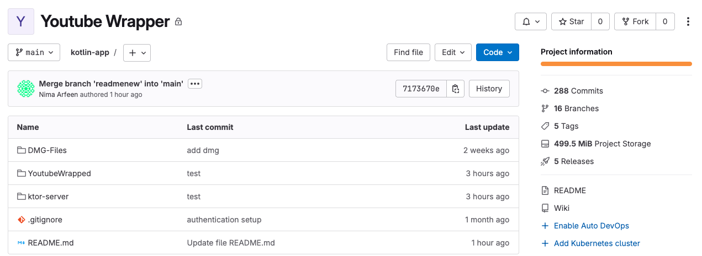

## YoutubeWrapped
A YoutubeWrapped showing your viewing statistics

## Video Walkthrough

[Application Video](https://youtu.be/dhabIYen2hc)

## Getting Started

[App Download Link](https://drive.google.com/file/d/1LbUhOJJf5Gn5lI5f0qwL5Fc2cLkhI5mJ/view)

Frontend (User App):
1. Download the app for your OS:
2. macOS: YouTubeWrapped.dmg
3. Install it like any normal app.
4. On first launch, sign in and upload your YouTube data to start generating your dashboard.

## Team Details

### Members
* Ashnoor Randhawa (akrandha@uwaterloo.ca)
* Nima Arfeen (naarfeen@uwaterloo.ca)
* Nivriti Bajwa (n3bajwa@uwaterloo.ca)
* Sam Meydanshahi (smeydans@uwaterloo.ca)

## GitLab Repo

The screenshot below displays the complete commit and branch history from our original UW GitLab repository. Due to privacy policies and migration constraints, the full history remains on GitLab, and this GitHub repository shows only a single, consolidated commit. This static snapshot preserves the detailed evolution of the project during its active development phase.

